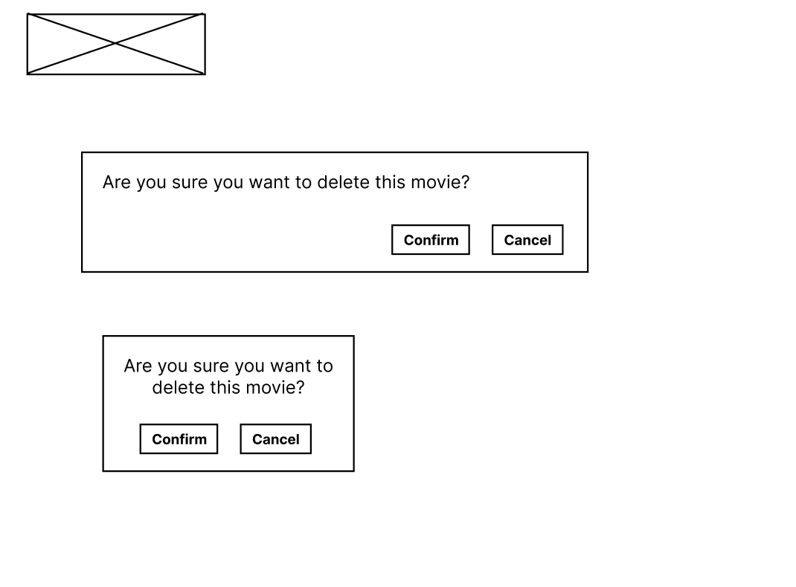

# MovieBud Movie Consumption Tracker

## Design
### Wireframes
**Desktop Size**  

 

**Mobile Size**  

 

### Mockups
**Desktop Size**  

**Mobile Size**  

 

## Iterations and Improvements
### Desktop Layout (includes tablet)
**Main Page**:  
- The heading for the 'Movies previously watched' was initially aligned to the left and has now been aligned to the center as it is makes it easier for users to notice.

**Show Page**:  
- The layout of the information contents have been changed to a 2 column structure to make it more seamless when transitioning to a mobile screen as most of the layout is similar.

 

### Mobile Layout
**Main Page**:  
- The button prompt to show the form inputs was removed so that the forms would appear upon rendering. The main reason for the button was to save space, however, there are only 2 input fields which ended up taking little space.

**Show Page**:  
- The title of the movie was initially placed at the bottom of the image but was changed so that the movie title is the first thing that they see. It also transitions well when the screen is resized to a larger display since on the desktop screen, the title is at the top.

 

### Functional
**Delete Confirmation Modal**:  
- The modal was initially meant to be aligned vertically at the middle of the information container, however, it was difficult to find where this modal (now positioned at the top of the buttons) was when the user is focused on the delete button that was clicked at the bottom.

 

**Invalid API Response**:  
- Based on the Assessment 2 feedback provided by my tutor, there should be a manual way that users could input all of the required information for a movie if it doesnt exist in the API or if there is missing information (my implementation considers a response with no poster image as invalid). However, with the time constriants, this feature could not be implemented and instead returned an error message to the user.

 

## Application Configurations
### Screen Dimensions:
Desktop - 1024px  
Tablet - 768px  
Mobile - 320px

 

### OMDb API: 
- An API key is required, which can be obtained from their website at https://www.omdbapi.com/apikey.aspx
- The documentation for implementing it can also be found on their website at https://www.omdbapi.com/

 

## Deployment Procedures
### Installing dependencies
This application uses Express for the web server, Sass for the styling and Parcel for bundling.

Run these commands:
- npm install express
- npm install sass
- npm install parcel –save-dev 
 

Parcel will be used during development

 

### Running the server
When in development, run this command:
- ``npm run dev``
 

Parcel automatically updates the server and no restarting is needed.  
Use port 1234 (localhost:1234) in the URL adress bar

 

When in deployment, run this command:
- ``npm run start``
 

Use port 8888 (localhost:8888) in the URL address bar